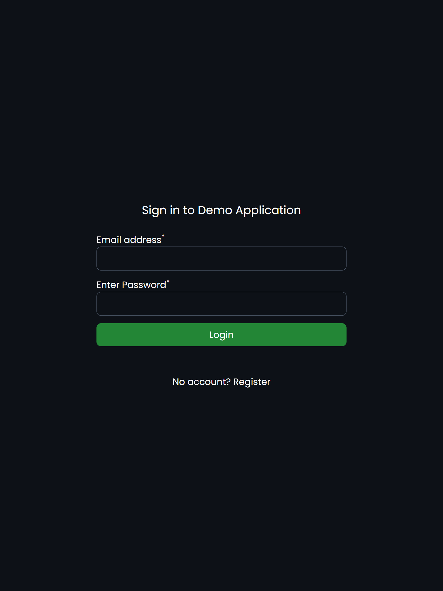
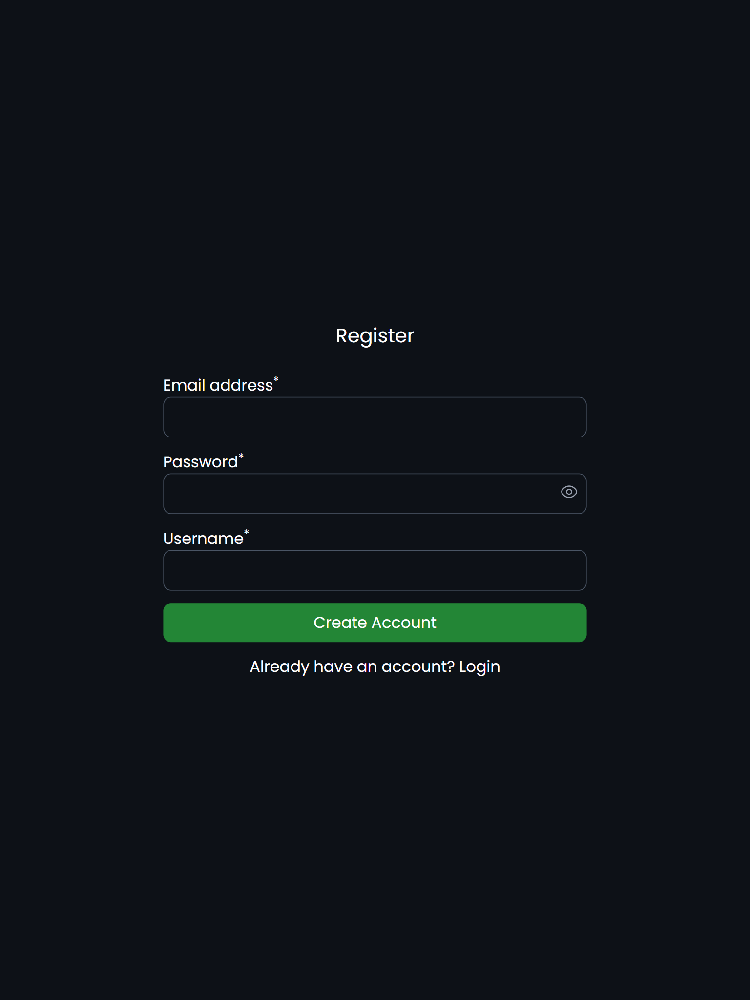

# User Authentication App (React + TypeScript)

A simple user authentication system built with **React, TypeScript, and LocalStorage**.
Users can register, log in, and view/update their profile information.  
This project was created as part of an internship assignment.

---

### 🔗 [Live Demo](http://user-authh.netlify.app)

## 📱 Features

✔ User Registration (email, username, password)  
✔ Login authentication  
✔ Profile page with editable username & password  
✔ Show/Hide password toggle  
✔ Protected route: only logged-in users can access profile  
✔ Logout functionality  
✔ Form validation & error messages  
✔ Fully responsive UI  
✔ Built using React Hooks & TypeScript

---

## ⚙️ Tech Stack

| Technology   | Usage                            |
| ------------ | -------------------------------- |
| React + Vite | Frontend framework and tooling   |
| TypeScript   | Type safety                      |
| React Router | Routing and protected routes     |
| Tailwind CSS | Styling                          |
| LocalStorage | Persisting user data and session |

---

## 🏣 Project Structure

```bash
src/
│
├── pages/
│ ├── Login.tsx
│ ├── Register.tsx
│ ├── Profile.tsx
│
├── utils/
│ ├── auth.ts (handles login, registration, logout, user update)
│
│
├── App.tsx
├── main.tsx
```

---

## ✅ Getting Started

### 1. Clone the repository

```bash
git clone https://github.com/askpundir-dev/user_authentication_app.git
cd user_authentication_app
```

### 2. Install dependencies

```bash
npm install

```

### 3. Run the development server

```bash
npm run dev

```

### Now open the app in the browser:

👉 http://localhost:5173

(or the URL shown in terminal)

## 🔩 Future Improvements

- Password strength meter

- Backend API integration

- JWT-based authentication

- Forgot password flow

---

## 📱 Screenshots

### ➡️ Login Page



### 🔍 Registration Page


